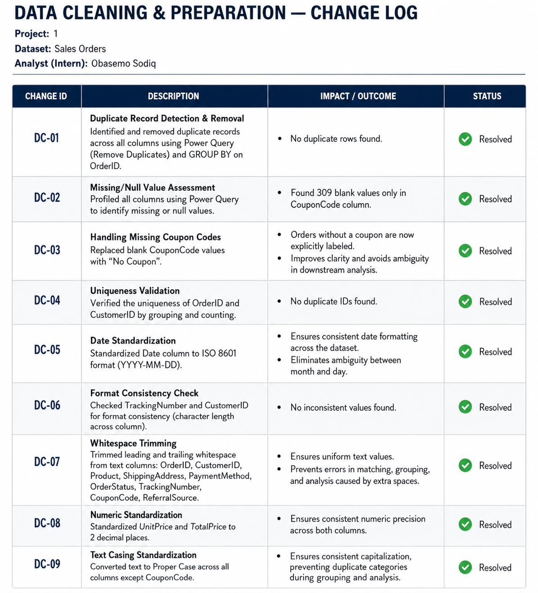

# Sales Orders Data Cleaning & Preparation

## Overview

This project focuses on cleaning and preparing a Sales Orders dataset for reliable analysis.

As part of my **Data Analytics Internship**, I worked through the dataset to identify potential data-quality issues, validate the information, standardize fields, and produce a clean version that can be used for analysis and reporting.

The project demonstrates a practical data-cleaning workflow using **Microsoft Excel and Power Query**.

**Analyst:** Obasemo Sodiq  
**Role:** Data Analytics Intern  
**Tools:** Microsoft Excel, Power Query

---

## Project Objective

The goal was to turn the raw sales data into a structured, consistent, and analysis-ready dataset.

The cleaning process focused on:

- Checking for duplicate records
- Checking for missing values
- Validating data types
- Standardizing text fields
- Checking date formats
- Validating numerical fields
- Reviewing the consistency of the dataset
- Preparing the final dataset for further analysis

---

## Dataset

The dataset contains **1,200 sales-order records and 14 columns**.

It includes information relating to orders, customers, products, pricing, payment methods, order status, and other sales-related attributes.

Some of the key fields include:

- Order ID
- Order Date
- Customer information
- Product/Item information
- Quantity
- Unit Price
- Total Price
- Payment Method
- Order Status
- Referral Source

---

## Data Cleaning Process

### 1. Duplicate Check

The dataset was checked for duplicate records to ensure that the same transaction was not represented more than once.

**Result:** No duplicate records requiring removal were identified.

### 2. Missing-Value Check

All fields were reviewed for blank or missing values.

**Result:** No missing values requiring treatment were identified.

### 3. Data Type Validation

Columns were reviewed to ensure that each field was stored using an appropriate data type.

For example:

- Dates were treated as date values
- Quantities were treated as numerical values
- Prices were treated as numerical values
- Categorical fields were maintained as text

### 4. Text Standardization

Text fields were reviewed for consistency, including unnecessary spaces and formatting differences that could affect filtering, grouping, and analysis.

### 5. Date Validation

Date fields were reviewed to ensure consistent formatting and to make the dataset suitable for time-based analysis.

### 6. Numerical Validation

Numerical fields such as quantity, unit price, and total price were reviewed for consistency and validity.

---

## Result

The final dataset is structured and ready for further analysis.

The project maintains both the **original raw dataset** and the **cleaned dataset**, making it possible to clearly distinguish between the starting data and the prepared output.

This provides a simple and transparent workflow:

**Raw Data → Data Validation → Cleaning & Standardization → Analysis-Ready Data**

---

## Files in This Repository

| File | Description |
|---|---|
| `Sales_Orders_Raw.xlsx` | Original sales-order dataset |
| `Sales_Orders_Cleaned.xlsx` | Cleaned and analysis-ready dataset |
| `data-cleaning-change-log.png` | Summary of the data-cleaning activities |
| `README.md` | Project documentation |

---

## Change Log

The change log provides a documented summary of the checks and preparation activities carried out during the project.

---

## Tools Used

**Microsoft Excel**  
Used for data inspection, validation, formatting, and dataset management.

**Power Query**  
Used for data transformation, cleaning, standardization, and preparation.

---

## Key Takeaways

This project is to give practical experience with the part of data analysis that happens **before the dashboard or analysis begins**.

I strengthened my ability more to:

- Assess data quality
- Identify potential data issues
- Validate datasets systematically
- Clean and standardize data
- Document data preparation steps
- Maintain raw and cleaned versions of a dataset
- Prepare data for downstream analysis and reporting

A reliable analysis starts with reliable data, and this project reinforced the importance of getting the data foundation right before drawing conclusions from it.

---

## About Me

**Obasemo Sodiq**

Data Analytics | Excel | SQL | Power BI | Python | Business Analytics

This project is part of my ongoing development and portfolio as I build practical experience in data analytics.
